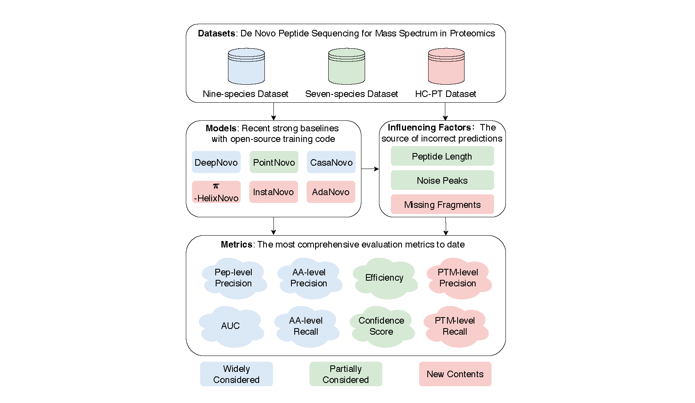

# NovoBench: Benchmark $de$ $novo$ peptide sequencing algorithms
<p>
  <a href="https://github.com/pytorch/pytorch"> </a>
  <a href="https://github.com/Lightning-AI/pytorch-lightning"> </a>
<p>

<p align="center" width="100%">
  <!--  -->
  
</p>

## Introduction
Tandem mass spectrometry has played a pivotal role in advancing proteomics, enabling the analysis of protein composition in biological tissues. Many deep learning methods have been developed for $de$ $novo$ peptide sequencing task, i.e., predicting the peptide sequence for the observed mass spectrum. However, two key challenges seriously hinder the further research of this important task. Firstly, since there is no consensus for the evaluation datasets, the empirical results in different research papers are often not comparable, leading to unfair comparison. Secondly, the current methods are usually limited to amino acid-level or peptide-level precision and recall metrics. In this work, we present the first unified benchmark NovoBench for $de$ $novo$ peptide sequencing, which comprises diverse mass spectrum data, integrated models, and comprehensive evaluation metrics. Recent impressive methods, including DeepNovo, PointNovo, Casanovo, InstaNovo, AdaNovo and $\pi$-HelixNovo are integrated into our framework. In addition to amino acid-level and peptide-level precision and recall, we also evaluate the models' performance in terms of identifying post-tranlational modifications (PTMs), efficiency and robustness to peptide length, noise peaks and missing fragment ratio, which are important influencing factors while seldom be considered. Leveraging this benchmark, we conduct a large-scale study of current methods, report many insightful findings that open up new possibilities for future development. 


## Installation 
This project has provided an environment setting file of conda, users can easily reproduce the environment by the following commands:
```shell
conda env create -f novobench.yaml
conda activate novobench
```

## Dataset download

All the necessary data files can be downloaded from the [link](https://huggingface.co/datasets/jingbo02/NovoBench).

## Train a new  model 
To train a model from scratch, run:
```shell
python tests/casanovo.py --mode train --data_path parquet_path --model_path ckpt_path  --config_path config_path
```


## Sequence mass spectra
To sequence the mass spectra with NovoBench, use the following command:
```shell
python tests/casanovo.py --mode seq --data_path parquet_path --model_path ckpt_path --denovo_output_path csv_path --config_path config_path
``` 

## ! Note

- DeepNovo and PointNovo <U>need more cpu</U> to process the dataset.
- The unified config file for DeepNovo and PointNovo is <U>in progress</U>. Currently, other models can run using a single config file.

## Citation
```bibtex
@misc{zhou2024novobenchbenchmarkingdeeplearningbased,
      title={NovoBench: Benchmarking Deep Learning-based De Novo Peptide Sequencing Methods in Proteomics}, 
      author={Jingbo Zhou and Shaorong Chen and Jun Xia and Sizhe Liu and Tianze Ling and Wenjie Du and Yue Liu and Jianwei Yin and Stan Z. Li},
      year={2024},
      eprint={2406.11906},
      archivePrefix={arXiv},
      primaryClass={q-bio.QM},
      url={https://arxiv.org/abs/2406.11906}, 
}
```